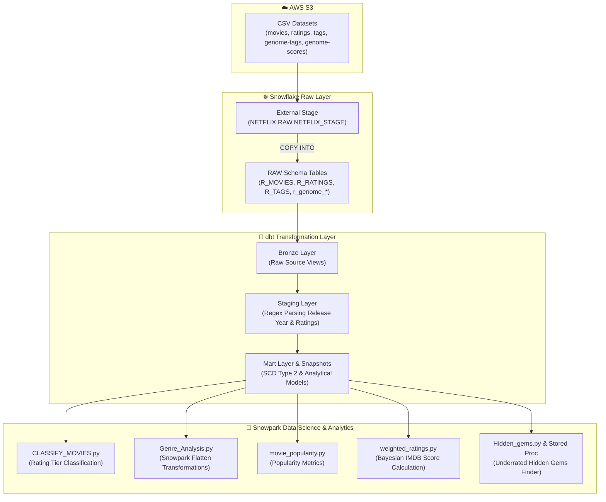

# 🎬 Netflix Movie Analytics & Recommendation Data Pipeline

An enterprise-grade movie analytics platform leveraging **Snowflake**, **dbt (Medallion Architecture)**, and **Snowpark Python** for data modeling, machine learning, and advanced feature engineering.

---

## 📌 Project Overview

The **Netflix Data Pipeline** ingests raw movie catalog datasets, user ratings, tags, and genome relevance scores from AWS S3 into Snowflake. It applies a **Medallion Architecture (Bronze ➔ Staging ➔ Mart)** using dbt for transformations, CDC tracking via dbt Snapshots, and executes advanced Python machine learning & statistical feature engineering using **Snowpark Python**.

---

## 💡 Tech Stack Rationale: Why Snowflake + dbt + Snowpark?

| Technology | Why It Was Chosen |
| :--- | :--- |
| **❄️ Snowflake** | • **Scalable Cloud Warehouse**: Independent scaling of compute (`NETFLIX_WH`) and storage.<br>• **Native S3 Integration**: Fast CSV ingestion using `netflix_s3_int` storage integration.<br>• **Enterprise RSA Authentication**: Configured with Key-Pair RSA encryption (`RSA_PUBLIC_KEY`) for secure Python & CI/CD access without hardcoded passwords. |
| **🥇 dbt (data build tool)** | • **Medallion Pipeline Architecture**: Clean separation between **Bronze** (raw entry), **Staging** (parsed & clean), and **Mart** (curated analytics).<br>• **SCD Type 2 Snapshots**: Built-in change data capture tracking for movie metadata and rating updates (`R_MOVIES_snapshot`, `R_Ratings_snapshot`).<br>• **Custom Test Macros**: Data verification using SQL macros (`positive_rating`, `no_future_rating`) and singular tests (`test_rating.sql`). |
| **🐍 Snowpark Python** | • **Zero-Egress Execution**: Runs Python DataFrames natively inside Snowflake virtual warehouses without transferring data to external servers.<br>• **Relational Flattening**: Uses Snowpark `flatten()` table functions for splitting pipe-delimited genre strings into relational rows.<br>• **Complex Analytics & Stored Procs**: Implements Bayesian IMDB weighted rating algorithms and deploys algorithms as native Snowflake Stored Procedures (`proc_hidden_gems.py`). |

---

## 📐 Architecture Diagram



---

## 🧪 Custom dbt Testing & Quality Framework

Data validation is enforced across the dbt pipeline through custom macro tests, singular SQL tests, and generic constraints configured in `models/Staging/__staging.yml`:

### 1. Custom Macro Tests (`macros/tests/`)
- **`positive_rating(model, column_name)`**:
  - **Location**: [`positive_rating.sql`](file:///c:/Snowflake/zomato-pipeline/Netflix-data-pipeline/netflix_dbt/macros/tests/positive_rating.sql)
  - **Logic**: Asserts that rating scores cannot be negative (`rating >= 0`). Fails if any rating `< 0` is detected.
- **`no_future_rating(model, column_name)`**:
  - **Location**: [`no_future_rating.sql`](file:///c:/Snowflake/zomato-pipeline/Netflix-data-pipeline/netflix_dbt/macros/tests/no_future_rating.sql)
  - **Logic**: Ensures timestamps and dates associated with ratings do not occur in the future (`rating_date <= current_date()`).

### 2. Singular Test (`tests/`)
- **`test_rating.sql`**:
  - **Location**: [`test_rating.sql`](file:///c:/Snowflake/zomato-pipeline/Netflix-data-pipeline/netflix_dbt/tests/test_rating.sql)
  - **Logic**: Singular test querying `stg_R_RATINGS` to flag low rating anomalies (`rating < 2`).

### 3. Generic Column Constraints (`__staging.yml`)
- **`stg_R_MOVIES`**: `MOVIEID` (`unique`, `not_null`), `MOVIE_NAME` (`not_null`).
- **`stg_R_RATINGS`**: `RATING` (`not_null`, `positive_rating`, `test_rating`), `rating_date` (`no_future_rating`).

To execute all tests:
```bash
cd netflix_dbt
dbt test
```

---

## 📁 Repository Structure

```text
Netflix-data-pipeline/
├── snowflakescripts/
│   ├── 01_Netflix_setup.sql          # Warehouse, Database, Schemas & Security Roles
│   ├── 02_Netflix_stage.sql          # AWS S3 Storage Integration & File Formats
│   ├── 03_Netflix_Table_creation.sql # RAW DDL (R_MOVIES, R_RATINGS, R_TAGS, genome)
│   └── 04_Netflix_Data_load.sql      # COPY INTO statements & RSA Public Key config
├── netflix_dbt/                      # dbt Medallion Architecture Project
│   ├── dbt_project.yml               # dbt project configuration
│   ├── macros/
│   │   ├── generate_schema_name.sql  # Dynamic schema routing
│   │   └── tests/                    # Custom SQL macro tests
│   │       ├── positive_rating.sql   # Custom test: rating >= 0
│   │       └── no_future_rating.sql  # Custom test: date <= today
│   ├── models/
│   │   ├── Bronze/                   # Bronze raw views
│   │   ├── Staging/                  # Staging clean views & __staging.yml
│   │   └── Mart/                     # Analytics Mart views
│   ├── snapshots/                    # dbt Snapshots for CDC tracking
│   │   ├── R_MOVIES_snapshot.sql     # Movie metadata CDC
│   │   └── R_Ratings_snapshot.sql    # Ratings CDC
│   └── tests/
│       └── test_rating.sql           # Singular anomaly test
└── snowpark Transformation Scripts/  # Snowpark Python Scripts
    ├── CLASSIFY_MOVIES.py            # Rating tier classification
    ├── GET_MOVIE_GENRES.py           # Genre parsing helper
    ├── Genre_Analysis.py             # Relational genre flattening
    ├── Hidden_gems.py                # Underrated movie discovery logic
    ├── movie_popularity.py           # Popularity ranking engine
    ├── proc_hidden_gems.py           # Native Snowflake Stored Procedure registration
    └── weighted_ratings.py           # Bayesian IMDB weighted score model
```

---

## 🛠️ Data Infrastructure & Schema

### 1. Snowflake Setup
- **Warehouse**: `NETFLIX_WH` (Size: `X-SMALL`, Auto-Suspend: 10s, Auto-Resume: `TRUE`)
- **Database**: `NETFLIX`
- **Schemas**: `RAW`, `STAGING`, `MART`
- **Role**: `NETFLIX_ROLE` with RSA Public Key authentication

### 2. Core RAW Tables
- `R_MOVIES`: `movieId` (PK), `title`, `genres`
- `R_RATINGS`: `R_KEY` (PK), `movieId` (FK), `rating`, `RATING_TIMESTAMP`
- `R_TAGS`: `userId`, `movieId` (FK), `tag`, `TAG_TIMESTAMP`
- `r_genome_tags`: `tagid` (PK), `tag`
- `r_genome_scores`: `movieId` (FK), `tagId`, `relevance`

---

## 🏃 Setup & Execution Instructions

### Step 1: Initialize Snowflake Environment & Load Data
Execute the SQL scripts in sequence:
```sql
-- 1. Setup Database, Schemas, Roles & Warehouse
!sqlfile snowflakescripts/01_Netflix_setup.sql;

-- 2. Setup AWS S3 Integration & Stage
!sqlfile snowflakescripts/02_Netflix_stage.sql;

-- 3. Create RAW Tables
!sqlfile snowflakescripts/03_Netflix_Table_creation.sql;

-- 4. Load CSV Datasets & Register RSA Public Key
!sqlfile snowflakescripts/04_Netflix_Data_load.sql;
```

### Step 2: Execute dbt Medallion Models, Snapshots & Tests
Navigate to `netflix_dbt`:
```bash
cd netflix_dbt

# Validate connection
dbt debug

# Run Bronze, Staging, and Mart models
dbt run

# Execute dbt Snapshots for CDC tracking
dbt snapshot

# Run all custom & generic tests
dbt test
```

### Step 3: Run Snowpark Analytics & Feature Engineering
Ensure private key RSA file is configured and run Snowpark Python scripts:
```bash
cd "snowpark Transformation Scripts"

# 1. Compute Bayesian Weighted Ratings (IMDB Formula)
python weighted_ratings.py

# 2. Perform Snowpark Flatten Genre Analysis
python Genre_Analysis.py

# 3. Classify Movies by Rating Quantiles
python CLASSIFY_MOVIES.py

# 4. Discover Hidden Gems & Register Stored Procedure
python Hidden_gems.py
python proc_hidden_gems.py
```

---

## 📊 Analytics & Feature Engineering Outputs

1. **`NETFLIX.MART.GENRE_ANALYSIS`**: Genre-normalized rating and metric distribution tables.
2. **`NETFLIX.MART.MOVIE_CLASSIFICATION`**: Segmented movie catalog tiers (High, Medium, Low rated).
3. **`NETFLIX.MART.WEIGHTED_RATINGS`**: IMDB Bayesian weighted rankings ($WR = \frac{v}{v+m} R + \frac{m}{v+m} C$).
4. **`NETFLIX.MART.HIDDEN_GEMS`**: Curated list of high-rating, lower-vote-count titles ideal for recommendation highlights.
