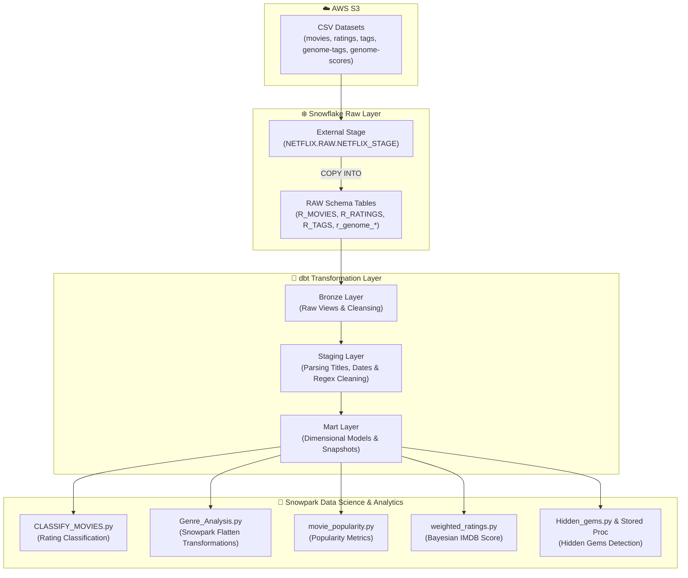

# 🎬 Netflix Movie Analytics & Recommendation Data Pipeline

An enterprise-grade movie analytics platform leveraging **Snowflake**, **dbt (Medallion Architecture)**, and **Snowpark Python** for data modeling, machine learning, and advanced feature engineering.

---

## 📐 Architecture Diagram



---

## 🚀 Key Features & Highlights

- **Secure RSA Key-Pair Authentication**: Snowflake access using RSA public/private key-pair authentication for secure automated data processing.
- **Medallion Architecture (dbt)**:
  - **Bronze**: Standardized raw entry point preserving raw source attributes.
  - **Staging**: Regex parsing for extracting movie release years from titles, rating validation, and missing value imputation.
  - **Mart**: Dimensional analytical models and dbt Snapshots (`R_MOVIES_snapshot`, `R_Ratings_snapshot`) for historical change tracking (SCD Type 2).
  - **Custom dbt Macros & Tests**: Custom test macros like `positive_rating` and `no_future_rating`.
- **Snowpark Python Machine Learning & Analytics**:
  - **Genre Normalization**: Exploiting Snowpark `flatten()` table functions to split pipe-delimited string genres into relational genre mapping rows.
  - **Bayesian Weighted Ratings**: Implementing IMDB's weighted rating formula ($WR = \frac{v}{v+m} R + \frac{m}{v+m} C$) to eliminate sample size bias in ratings.
  - **Movie Classification**: Categorizing titles based on user rating quantiles.
  - **Hidden Gems Detection & Stored Procedures**: Identifying high-quality, underrated titles using Snowpark DataFrames and executing as native Snowflake Stored Procedures (`proc_hidden_gems.py`).

---

## 📁 Repository Structure

```text
Netflix-data-pipeline/
├── snowflakescripts/
│   ├── 01_Netflix_setup.sql          # Warehouse, Database, Schemas & Security Roles
│   ├── 02_Netflix_stage.sql          # AWS S3 Storage Integration & File Formats
│   ├── 03_Netflix_Table_creation.sql # RAW DDL (R_MOVIES, R_RATINGS, R_TAGS, genome)
│   └── 04_Netflix_Data_load.sql      # COPY INTO statements & RSA Public Key config
├── netflix_dbt/                      # dbt Data Pipeline
│   ├── dbt_project.yml               # dbt project configuration
│   ├── macros/
│   │   ├── generate_schema_name.sql  # Dynamic schema generation
│   │   └── tests/                    # Custom dbt test assertions
│   ├── models/
│   │   ├── Bronze/                   # Bronze raw transformation views
│   │   ├── Staging/                  # Staging clean views (stg_R_MOVIES, etc.)
│   │   └── Mart/                     # Analytics Mart views (mart_r_movies, etc.)
│   ├── snapshots/                    # dbt Snapshots for CDC tracking
│   └── tests/                        # Data quality tests
└── snowpark Transformation Scripts/  # Python Snowpark Scripts
    ├── CLASSIFY_MOVIES.py            # Movie rating tier classification
    ├── GET_MOVIE_GENRES.py           # Genre extraction
    ├── Genre_Analysis.py             # Relational genre flattening & analysis
    ├── Hidden_gems.py                # Underrated movie discovery logic
    ├── movie_popularity.py           # Movie popularity ranking engine
    ├── proc_hidden_gems.py           # Snowpark Stored Procedure definition
    └── weighted_ratings.py           # Bayesian IMDB weighted score implementation
```

---

## 🛠️ Data Infrastructure & Schema

### 1. Snowflake Setup
- **Warehouse**: `NETFLIX_WH` (Size: `X-SMALL`, Auto-Suspend: 10s, Auto-Resume: `TRUE`)
- **Database**: `NETFLIX`
- **Schemas**: `RAW`, `STAGING`, `MART`
- **Role**: `NETFLIX_ROLE`

### 2. Core Tables
- `R_MOVIES`: `movieId` (PK), `title`, `genres`
- `R_RATINGS`: `R_KEY` (PK), `movieId` (FK), `rating`, `RATING_TIMESTAMP`
- `R_TAGS`: `userId`, `movieId` (FK), `tag`, `TAG_TIMESTAMP`
- `r_genome_tags`: `tagid` (PK), `tag`
- `r_genome_scores`: `movieId` (FK), `tagId`, `relevance`

---

## 🏃 How to Run the Pipeline

### Step 1: Execute Snowflake DDL & Data Ingestion
Run the SQL scripts in order:
```sql
-- 1. Setup Infrastructure
!sqlfile snowflakescripts/01_Netflix_setup.sql;

-- 2. Create Storage Integration & Stage
!sqlfile snowflakescripts/02_Netflix_stage.sql;

-- 3. Create Tables
!sqlfile snowflakescripts/03_Netflix_Table_creation.sql;

-- 4. Load S3 Data & Register RSA Key
!sqlfile snowflakescripts/04_Netflix_Data_load.sql;
```

### Step 2: Execute dbt Medallion Transformations
Navigate to the `netflix_dbt` directory:
```bash
cd netflix_dbt

# Validate connection
dbt debug

# Run Bronze, Staging, and Mart models
dbt run

# Run dbt snapshots (SCD Type 2)
dbt snapshot

# Execute data quality tests
dbt test
```

### Step 3: Run Snowpark Analytics & Feature Engineering
Ensure private key RSA file is present and run Python transformation scripts:
```bash
cd "snowpark Transformation Scripts"

# Run Bayesian Weighted Ratings model
python weighted_ratings.py

# Run Genre Flattening and Analysis
python Genre_Analysis.py

# Run Hidden Gems Analysis
python Hidden_gems.py

# Register Stored Procedure in Snowflake
python proc_hidden_gems.py
```

---

## 📊 Analytics & Data Science Outputs

1. **`NETFLIX.MART.GENRE_ANALYSIS`**: Normalized genre-level performance metrics.
2. **`NETFLIX.MART.MOVIE_CLASSIFICATION`**: Titles segmented into quality tiers.
3. **`NETFLIX.MART.WEIGHTED_RATINGS`**: IMDB Bayesian weighted score rankings.
4. **`NETFLIX.MART.HIDDEN_GEMS`**: Curated list of high-rated, lower-visibility movies recommended for spotlight features.
