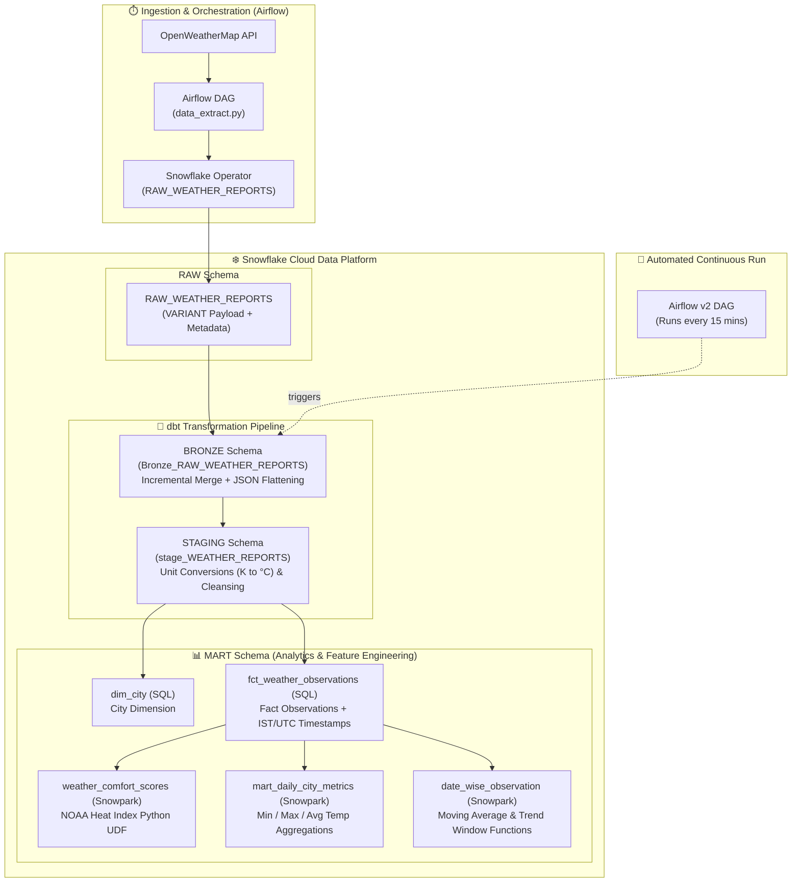

# 🌦️ End-to-End Weather Data Pipeline

[](https://www.snowflake.com/)
[](https://www.getdbt.com/)
[](https://airflow.apache.org/)
[](https://docs.snowflake.com/en/developer-guide/snowpark/python/index)
[](https://www.docker.com/)

A modern, production-grade **Weather Data Platform** utilizing the **Medallion Architecture (Bronze ➔ Staging ➔ Mart)** with **Apache Airflow**, **Snowflake**, **dbt Core**, and **Snowpark Python**.

The pipeline automatically extracts real-time weather metrics from OpenWeatherMap API, ingests semi-structured JSON payloads into Snowflake, runs incremental ELT transformations with dbt, and performs advanced analytical feature engineering (including NOAA Heat Index UDFs and windowed aggregations) using Snowpark Python.

---

## 📑 Table of Contents
- [Architecture Overview](#-architecture-overview)
- [Tech Stack & Key Components](#-tech-stack--key-components)
- [Data Flow & Medallion Layers](#-data-flow--medallion-layers)
- [Repository Structure](#-repository-structure)
- [Snowflake Infrastructure & DDL](#-snowflake-infrastructure--ddl)
- [dbt Models & Snowpark Transformations](#-dbt-models--snowpark-transformations)
- [Airflow Orchestration](#-airflow-orchestration)
- [Setup & Deployment Guide](#-setup--deployment-guide)

---

## 📐 Architecture Overview



---

## 🚀 Tech Stack & Key Components

| Technology | Role & Purpose |
| :--- | :--- |
| **Apache Airflow 2.9.1** | Containerized workflow orchestration handling periodic API polling, data extraction, raw staging, and triggering dbt runs. |
| **Snowflake Data Cloud** | Central data platform utilizing virtual warehouse `WEATHER_WH` with dedicated `WEATHER_ROLE` role-based access control and key-pair authentication. |
| **dbt Core (v1.8+)** | Modular data modeling using incremental merge strategies, custom macros, and schema documentation. |
| **Snowpark Python (3.10)** | In-database Python data transformations, vector calculations, and custom `@udf` for thermal comfort index calculation without data egress. |
| **Docker & Docker Compose** | Local containerization for Airflow scheduler, webserver, init container, and Postgres metadata database. |

---

## 🥇 Data Flow & Medallion Layers

### 1. RAW Layer (`WEATHER.RAW`)
- Ingests raw API response payloads into `RAW_WEATHER_REPORTS`.
- Stores raw JSON as Snowflake `VARIANT` alongside ingestion timestamps.

### 2. Bronze Layer (`WEATHER.BRONZE`)
- Model: `Bronze_RAW_WEATHER_REPORTS`
- **Materialization**: `incremental` (Merge strategy on `['city_id', 'weather_dt']`)
- **Transformations**:
  - Parses JSON `RAW_PAYLOAD` into typed relational columns (coordinates, temperature, pressure, humidity, wind speed, timestamps).
  - Uses `QUALIFY row_number() OVER (PARTITION BY city_id, weather_dt ORDER BY weather_dt DESC) = 1` for deduplication.

### 3. Staging Layer (`WEATHER.STAGING`)
- Model: `stage_WEATHER_REPORTS`
- **Materialization**: `incremental` (Merge strategy on `['city_name', 'weather_dt']`)
- **Transformations**:
  - Converts temperature units from Kelvin ($K$) to Celsius ($°C$):
    $$\text{Temp}_{°C} = \text{Temp}_K - 273.15$$
  - Cleanses wind gust, speed, and weather condition tags.

### 4. Mart Layer (`WEATHER.MART`)
- **`dim_city`** *(SQL Table)*: Unique city dimension containing `city_id`, `city_name`, `country`, `lat`, `lon`.
- **`fct_weather_observations`** *(Incremental SQL Table)*: Granular weather observations with UTC and Indian Standard Time (`Asia/Kolkata`) timestamps, plus day/night categorization.
- **`weather_comfort_scores`** *(Snowpark Python Table)*:
  - Registers a scalar Snowpark Python `@udf` that computes the **NOAA Heat Index** based on ambient temperature and relative humidity:
  - Dynamically calculates heat perception in Celsius for public safety and comfort assessment.
- **`mart_daily_city_metrics`** *(Snowpark Python Table)*:
  - Daily aggregated analytics: `min_temp`, `max_temp`, `avg_temp`, and total cumulative temperature per day.
- **`date_wise_observation`** *(Snowpark Python Table)*:
  - Employs Snowpark `Window` functions to compute moving observations and overall city averages.

---

## 📁 Repository Structure

```text
Weather-data-pipeline/
├── airflow/
│   ├── Dockerfile                      # Airflow image with Snowflake provider & patch tools
│   ├── docker-compose.yaml             # Multi-service setup (Webserver, Scheduler, Postgres)
│   ├── requirements.txt                # Airflow Python dependencies
│   └── dags/
│       ├── data_extract.py             # Weather API extraction DAG
│       ├── snowflake_data_insert.py    # Snowflake raw ingestion DAG
│       ├── snowflake_test.py           # Connectivity validation DAG
│       └── weather_data_pipeline_v2.py # Production DAG (triggers dbt run every 15 mins)
│
├── snowflake_scripts/
│   ├── 01_weather_data_setup.sql       # Warehouse, Database, Schemas, & RBAC setup
│   └── 02_weather_data_table_creation.sql # RAW_WEATHER_REPORTS table DDL
│
└── weather_data/                       # dbt & Snowpark Project
    ├── dbt_project.yml                 # dbt configurations & model materializations
    ├── macros/
    │   └── generate_schema_name.sql    # Custom schema router for clean schema naming
    └── models/
        ├── Bronze/
        │   ├── __source.yml            # Source declaration for RAW schema
        │   └── Bronze_RAW_WEATHER_REPORTS.sql # Incremental Bronze parsing model
        ├── Staging/
        │   ├── __stage.yml             # Staging tests and documentation
        │   └── stage_WEATHER_REPORTS.sql      # Temperature conversion and cleansing
        └── Mart/
            ├── __mart.yml              # Mart column tests and schema constraints
            ├── dim_city.sql            # City Dimension table
            ├── fct_weather_observations.sql   # Observations Fact table
            ├── weather_comfort_scores.py      # Snowpark Python Heat Index UDF model
            ├── mart_daily_city_metrics.py     # Snowpark Python Daily Aggregations
            └── date_wise_observation.py       # Snowpark Python Windowing model
```

---

## ❄️ Snowflake Infrastructure & DDL

Execute scripts in [`snowflake_scripts/`](snowflake_scripts/):

1. **Warehouse & RBAC Configuration**:
   - **Warehouse**: `WEATHER_WH` (`X-SMALL`, Auto-suspend: 30s, Auto-resume: `TRUE`)
   - **Database**: `WEATHER`
   - **Schemas**: `RAW`, `BRONZE`, `STAGING`, `MART`
   - **Role**: `WEATHER_ROLE` granted `USAGE` & `OPERATE` on warehouse and `ALL` privileges on schemas.

2. **Raw Table Schema**:
```sql
CREATE OR REPLACE TABLE WEATHER.RAW.RAW_WEATHER_REPORTS (
    LOADED_AT    TIMESTAMP_NTZ DEFAULT CURRENT_TIMESTAMP(),
    CITY_NAME    VARCHAR(100),
    RAW_PAYLOAD  VARIANT
);
```

---

## 🛠️ Setup & Deployment Guide

### Prerequisites
- Docker & Docker Compose installed
- Snowflake Account with `ACCOUNTADMIN` or appropriate privileges
- Python 3.9+ & dbt-snowflake installed locally (or via Docker)
- OpenWeatherMap API Key

### Step 1: Initialize Snowflake Database & Permissions
Run the SQL scripts in Snowflake Snowsight or via SnowSQL:
```sql
-- Run setup script
!source snowflake_scripts/01_weather_data_setup.sql;

-- Create RAW table
!source snowflake_scripts/02_weather_data_table_creation.sql;
```

### Step 2: Configure dbt Profile (`profiles.yml`)
Ensure your `~/.dbt/profiles.yml` contains the `weather_data` target:
```yaml
weather_data:
  target: dev
  outputs:
    dev:
      type: snowflake
      account: <your_snowflake_account_identifier>
      user: <your_username>
      role: WEATHER_ROLE
      database: WEATHER
      warehouse: WEATHER_WH
      schema: PUBLIC
      threads: 4
      private_key_path: /path/to/rsa_key_pk8.pem
```

### Step 3: Run dbt Transformations & Validate
```bash
cd weather_data

# Test Snowflake connectivity
dbt debug

# Run all Bronze, Staging, and Mart models (SQL + Snowpark Python)
dbt run

# Run schema constraint tests (unique, not_null, relationships)
dbt test
```

### Step 4: Launch Apache Airflow via Docker
```bash
cd airflow

# Initialize Airflow DB and build containers
docker compose up airflow-init
docker compose up -d

# Open Airflow UI at http://localhost:8080 (Default credentials: airflow / airflow)
```

---

## 📈 Analytical Models & Insights

| Model Name | Type | Key Output & Insights |
| :--- | :--- | :--- |
| `dim_city` | Dimension | Normalized geographical attributes (Latitude, Longitude, Country) for spatial mapping. |
| `fct_weather_observations` | Fact | Time-series weather logs with local IST and UTC timestamps and day/night flags. |
| `weather_comfort_scores` | Snowpark Python | Perceived temperature index using polynomial heat index regression to identify extreme thermal stress. |
| `mart_daily_city_metrics` | Snowpark Python | Daily temperature extremes (Min, Max, Mean) for climate tracking and trend analysis. |
| `date_wise_observation` | Snowpark Python | Rolling multi-period temperature trends and cumulative deviation from city averages. |

---

## 👤 Author
- **Suvendu Sahani** - [@suvendusahani145-wq](https://github.com/suvendusahani145-wq)
