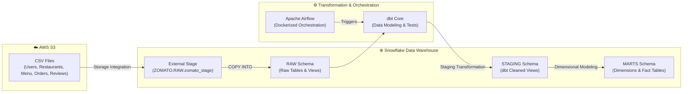

# 🍕 Zomato Food Delivery Data Pipeline

An end-to-end cloud data engineering pipeline for food delivery analytics, built with **Snowflake**, **dbt (data build tool)**, **AWS S3**, and **Apache Airflow**.

---

## 📐 Architecture Diagram



---

## 🚀 Key Features & Highlights

- **AWS S3 to Snowflake Integration**: Configured via Snowflake IAM Storage Integration (`Zomato_s3_int`) and custom CSV file formats.
- **Raw Data Ingestion**: Automated `COPY INTO` loading scripts for transactional food delivery data:
  - `USERS`, `RESTAURANTS`, `FOOD`, `MENU`, `ORDERS`, `ORDER_ITEMS`, `REVIEWS`.
- **Dimensional Data Modeling (dbt)**:
  - **Staging Layer (`RAW` ➔ `STAGING`)**: Data cleaning, type casting, rating normalization, and null-handling.
  - **Marts Layer (`STAGING` ➔ `MARTS`)**: Star-schema architecture with core dimension and fact tables:
    - **Dimensions**: `dim_customer`, `dim_restaurants`, `dim_food`
    - **Facts**: `fct_orders`, `fct_order_items`
    - **Analytical Marts**: `mart_city_wise_rder` (City-level performance & revenue analytics)
- **Containerized Orchestration**: Pre-configured **Apache Airflow** environment using Docker and Docker Compose.

---

## 📁 Repository Structure

```text
zomato-pipeline/
├── airflow/
│   ├── dags/                  # Airflow DAGs for pipeline orchestration
│   ├── docker-compose.yaml    # Docker Compose setup for local Airflow cluster
│   └── Dockerfile             # Custom Airflow image with dbt/Snowflake dependencies
├── csv files/                 # Raw seed CSV datasets
├── snowflake_scripts/
│   ├── Zomato_01_setup.sql        # Database, Warehouse, Roles & Permissions setup
│   ├── Zomato_02_Staging.sql      # S3 Storage Integration & External Stage setup
│   ├── Zomato_03_TABLE_CREATE.sql # RAW schema DDL script with Foreign Key constraints
│   └── Zomato_04_Table load.sql   # COPY INTO commands & loading validation logs
└── zomato/                    # dbt Project Root
    ├── dbt_project.yml        # dbt project configuration
    ├── models/
    │   ├── staging/           # Cleaned staging views (stg_users, stg_orders, etc.)
    │   └── marts/             # Star-schema dimensions & facts
    ├── macros/                # Custom dbt SQL macros
    ├── tests/                 # dbt quality & assertion tests
    └── snapshots/             # Slowly Changing Dimensions (SCD Type 2)
```

---

## 🛠️ Infrastructure & Database Schema

### 1. Snowflake Role & Warehouse Setup
- **Warehouse**: `ZOMATO_WH` (Size: `XSMALL`, Auto-Suspend: 60s, Auto-Resume: `TRUE`)
- **Database**: `ZOMATO`
- **Schemas**: `RAW`, `STAGING`, `MARTS`, `SNAPSHOTS`, `AI`
- **Role**: `DBT_ROLE` (Granted control over databases, schemas, stages, and tables)

### 2. Entity ERD Relationship
- **`USERS`** `(user_id)` ───< **`ORDERS`** `(order_id)` ───< **`ORDER_ITEMS`** `(order_item_id)`
- **`RESTAURANTS`** `(id)` ───< **`MENU`** `(menu_id)`
- **`FOOD`** `(f_id)` ───< **`MENU`** `(menu_id)`
- **`ORDERS`** `(order_id)` ───< **`REVIEWS`** `(review_id)`

---

## 🏃 How to Run the Pipeline

### Step 1: Execute Snowflake Setup Scripts
Run the scripts sequentially in Snowflake using `ACCOUNTADMIN` / `DBT_ROLE`:
```sql
-- 1. Create Warehouse, Database, Schemas, and Role
!sqlfile snowflake_scripts/Zomato_01_setup.sql;

-- 2. Configure AWS S3 Integration & Stage
!sqlfile snowflake_scripts/Zomato_02_Staging.sql;

-- 3. Create RAW Tables
!sqlfile snowflake_scripts/Zomato_03_TABLE_CREATE.sql;

-- 4. Load Raw Data from S3
!sqlfile snowflake_scripts/Zomato_04_Table load.sql;
```

### Step 2: Run dbt Transformations
Navigate to the `zomato` dbt directory:
```bash
cd zomato

# Test connectivity to Snowflake
dbt debug

# Run staging and marts models
dbt run

# Execute data quality tests
dbt test
```

### Step 3: Run Airflow Orchestration (Optional)
```bash
cd airflow
docker-compose up -d
```
Access the Airflow UI at `http://localhost:8080` to manage and execute DAGs.

---

## 📊 Analytics Marts Output

- **`dim_customer`**: User demographic summaries, order frequency, and age profiles.
- **`dim_restaurants`**: Restaurant metadata, average ratings, cuisines, and location mappings.
- **`dim_food`**: Food catalog categorizations (Veg vs. Non-Veg).
- **`fct_orders`**: Financial measures (subtotal, discounts, delivery fees, GST, sales amount), payment methods, and delivery times.
- **`mart_city_wise_rder`**: Executive metrics aggregating total orders, sales revenue, and average rating by city.
