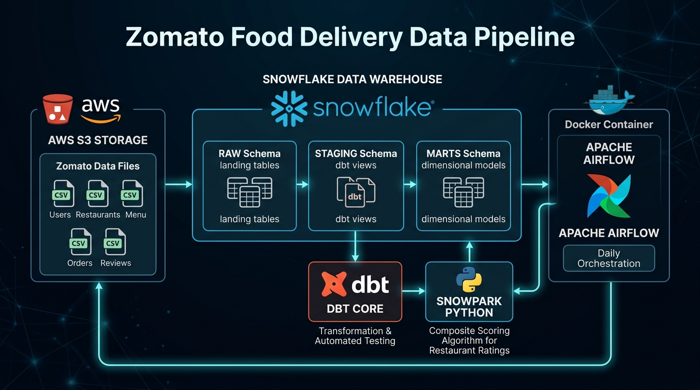

# 🍕 Zomato Food Delivery End-to-End Enterprise Data Pipeline

An enterprise-grade, cloud-native data engineering pipeline for food delivery analytics, built with **Snowflake**, **dbt Core**, **Snowpark Python**, **AWS S3**, and **Apache Airflow (Dockerized)**.

---

## 📌 Executive Summary & Architecture

The **Zomato Food Delivery Data Pipeline** automates the ingestion, cleansing, dimensional modeling, custom analytics, and orchestration of multi-gigabyte transactional dataset files (users, restaurants, menus, orders, line items, and customer reviews).

Data flows seamlessly from raw CSV files in AWS S3 into Snowflake's landing schema, undergoes dbt transformations into standardized staging views and star-schema data marts, runs Snowpark Python machine learning models for restaurant tiering, and is orchestrated daily via Dockerized Apache Airflow.

### 📐 High-Level Visual Architecture



### 🔄 End-to-End Pipeline Flow Diagram

```mermaid
flowchart TB
    %% Node Styling Definitions
    classDef s3Style fill:#FF9900,stroke:#232F3E,stroke-width:2px,color:#FFFFFF,font-weight:bold;
    classDef sfStyle fill:#29B5E8,stroke:#115D8C,stroke-width:2px,color:#FFFFFF,font-weight:bold;
    classDef dbtStyle fill:#FF694B,stroke:#C2341D,stroke-width:2px,color:#FFFFFF,font-weight:bold;
    classDef pyStyle fill:#3776AB,stroke:#1E415E,stroke-width:2px,color:#FFFFFF,font-weight:bold;
    classDef afStyle fill:#017CEE,stroke:#00488A,stroke-width:2px,color:#FFFFFF,font-weight:bold;

    subgraph S3 ["☁️ AWS S3 Storage Bucket"]
        CSV["📦 Raw CSV Datasets\n• users.csv (100k rows)\n• restaurant.csv (148k rows)\n• menu.csv (1.17M rows)\n• food.csv (371k rows)\n• orders.csv (10k rows)\n• order_items.csv (10k rows)\n• reviews.csv (300k rows)"]:::s3Style
    end

    subgraph Snowflake ["❄️ Snowflake Data Warehouse (Database: ZOMATO)"]
        subgraph Stage_Layer ["Ingestion Layer"]
            SI["🔐 Storage Integration\n(Zomato_s3_int)"]:::sfStyle
            ExtStage["📂 External Stage\n(@ZOMATO.RAW.zomato_stage)"]:::sfStyle
            RawSchema["🗄️ RAW Schema (7 Tables)\nUSERS, RESTAURANTS, FOOD,\nMENU, ORDERS, ORDER_ITEMS, REVIEWS"]:::sfStyle
        end

        subgraph Staging_Layer ["Cleansing Layer"]
            StgViews["⚡ dbt Staging Views\nstg_users, stg_restaurants, stg_food,\nstg_menu, stg_orders, stg_order_items, stg_reviews"]:::dbtStyle
        end

        subgraph Marts_Layer ["Modeling & Analytics Layer"]
            Dims["📐 Star-Schema Dimensions\ndim_customer, dim_restaurants, dim_food"]:::sfStyle
            Facts["📊 Incremental Fact Tables\nfct_orders, fct_order_items, fct_customer_data"]:::sfStyle
            MartsSQL["📈 Analytical Data Marts\nmart_city_wise_rder, mart_age_group_order_analysis\nmart_gender_wise_data, mart_income_band_wise_data"]:::sfStyle
            SnowparkModel["🐍 Snowpark Python ML Model\nrestaurant_rating.py\n(Composite Score & Tiering: Platinum, Gold, Silver, Bronze)"]:::pyStyle
        end
    end

    subgraph Orchestration ["⚙️ Dockerized Apache Airflow Cluster"]
        DAG["🚀 Airflow DAG: dbt_pipeline\n(Daily Execution Schedule)"]:::afStyle
        t1["1️⃣ dbt_run\n(dbt run --fail-fast)"]:::afStyle
        t2["2️⃣ dbt_test\n(dbt test --fail-fast)"]:::afStyle
        t3["3️⃣ dbt_log\n(dbt run --log-format json)"]:::afStyle
        t1 --> t2 --> t3
    end

    CSV -->|AWS IAM Storage Role| SI
    SI --> ExtStage
    ExtStage -->|COPY INTO Bulk Load| RawSchema
    RawSchema -->|dbt source()| StgViews
    StgViews -->|dbt ref()| Dims
    StgViews -->|dbt ref()| Facts
    Facts -->|dbt ref()| MartsSQL
    StgViews & Facts -->|Snowpark Dataframe API| SnowparkModel
    DAG -.->|Orchestrates Pipeline| Snowflake
```

---


## 🛠️ Technology Stack & Key Features

| Component | Technology | Rationale & Architectural Capabilities |
| :--- | :--- | :--- |
| **Data Warehouse** | **❄️ Snowflake** | • **Compute & Storage Decoupling**: Auto-suspending virtual warehouse (`ZOMATO_WH`, 60s auto-suspend).<br>• **Native S3 Ingestion**: High-throughput file loading via AWS IAM Storage Integration (`Zomato_s3_int`).<br>• **Multi-Schema Architecture**: Schema isolation across `RAW`, `STAGING`, `MARTS`, `SNAPSHOTS`, and `AI`.<br>• **RBAC Security**: Dedicated `DBT_ROLE` with least-privilege security model. |
| **Data Transformation** | **🥇 dbt Core** | • **ELT Pushdown**: High-performance transformation execution directly within Snowflake.<br>• **Modular Staging**: Regex cleansing, data type enforcement, null handling, and string standardization.<br>• **Incremental Loading**: Efficient `merge` incremental strategies on large transactional facts (`fct_orders`, `fct_order_items`).<br>• **Data Quality Assertions**: Automated generic assertion tests (`unique`, `not_null`) and referential integrity tests. |
| **Advanced Analytics** | **🐍 Snowpark Python** | • **Python Models in dbt**: Native execution of `restaurant_rating.py` using Snowpark Python 3.10.<br>• **Multi-Dimensional Window Scoring**: Uses `percent_rank()` window functions across 6 operational metrics.<br>• **Automated Tier Assignment**: Classifies restaurants into `PLATINUM`, `GOLD`, `SILVER`, and `BRONZE` tiers. |
| **Orchestration** | **⚙️ Apache Airflow** | • **DAG Scheduling**: Automated daily execution chain (`dbt_run` $\rightarrow$ `dbt_test` $\rightarrow$ `dbt_log`).<br>• **Dockerized Stack**: Multi-container setup with Postgres metadata store, Airflow Webserver, and Scheduler. |

---

## 📁 Repository Structure

```text
zomato-pipeline/
├── .dbt/
│   ├── .user.yml                      # dbt user configuration settings
│   └── profiles.yml                   # Snowflake connection profile for dbt (RSA Key Auth / DBT_ROLE)
├── airflow/
│   ├── dags/
│   │   └── dbt_pipeline.py            # Airflow DAG defining dbt execution & testing pipeline
│   ├── .gitignore                     # Airflow container ignore rules
│   ├── Dockerfile                     # Custom Airflow image with dbt-core & dbt-snowflake installed
│   └── docker-compose.yaml            # Local Airflow cluster setup (PostgreSQL, Webserver, Scheduler)
├── csv files/                         # Raw seed datasets for S3 ingestion
│   ├── food.csv                       # Catalog of food items (371,643 rows)
│   ├── menu.csv                       # Restaurant menu pricing catalog (1,179,938 rows)
│   ├── order_items.csv                # Order line item transactions (10,001 rows)
│   ├── orders.csv                     # Financial order records (10,001 rows)
│   ├── restaurant.csv                 # Restaurant metadata & location details (148,546 rows)
│   ├── reviews.csv                    # Customer feedback & ratings (300,002 rows)
│   └── users.csv                      # User demographic profiles (100,002 rows)
├── logs/                              # Execution logs
├── snowflake_scripts/                 # DDL & Data Ingestion Scripts
│   ├── Zomato_01_setup.sql            # Creates Warehouse, Database, Schemas, and DBT_ROLE permissions
│   ├── Zomato_02_Staging.sql          # Configures AWS S3 Storage Integration & External Stage (@zomato_stage)
│   ├── Zomato_03_TABLE_CREATE.sql     # DDL for RAW schema tables with primary & foreign key constraints
│   └── Zomato_04_Table load.sql       # COPY INTO ingestion commands & COPY_HISTORY validation logic
└── zomato/                            # Main dbt Transformation Project
    ├── .gitignore                     # dbt target & package exclusions
    ├── dbt_project.yml                # dbt project configurations & schema materialization definitions
    ├── README.md                      # dbt default documentation
    ├── models/
    │   ├── mart_income_band_wise_data # Data mart for monthly income band analysis
    │   ├── mart/                      # Dimensional Data Marts & Snowpark Python Models
    │   │   ├── __mart.yml             # Schema documentation & referential integrity tests
    │   │   ├── dim_customer.sql       # Customer dimension with age segmentation (Gen Z, Millennial, Gen X, Boomer)
    │   │   ├── dim_food.sql           # Food catalog dimension
    │   │   ├── dim_restaurants.sql    # Restaurant metadata dimension
    │   │   ├── fct_customer_data.sql  # Incremental customer order dimension fact table
    │   │   ├── fct_order_items.sql    # Incremental order line item fact table
    │   │   ├── fct_orders.sql         # Incremental financial transaction fact table
    │   │   ├── mart_age_group_order_analysis.sql # Aggregated revenue & order count by age group
    │   │   ├── mart_city_wise_rder.sql# Aggregated order status metrics by city
    │   │   ├── mart_gender_wise_data.sql # Aggregated order volume by gender
    │   │   └── restaurant_rating.py   # Snowpark Python composite scoring & restaurant tiering model
    │   └── staging/                   # Data Cleansing & Normalization Layer
    │       ├── __sources.yml          # Source declarations for Snowflake RAW schema tables
    │       ├── __stage.yml            # Data quality tests (unique, not_null) on staging models
    │       ├── stg_food.sql           # Cleans & normalizes food items
    │       ├── stg_menu.sql           # Cleans menu prices & parses numeric restaurant IDs
    │       ├── stg_order_items.sql    # Casts prices, line amounts, and quantities
    │       ├── stg_orders.sql         # Regex extracts city, creates delivery boolean flag, formats finances
    │       ├── stg_restaurants.sql    # Cleans cost for two, rating count, and ratings
    │       ├── stg_reviews.sql        # Standardizes customer reviews & joins restaurant city
    │       └── stg_users.sql          # Cleans customer demographics, emails, and family sizes
    ├── macros/                        # Custom dbt macros
    ├── seeds/                         # dbt seeds
    ├── snapshots/                     # dbt SCD Type-2 snapshots
    └── tests/                         # Custom data assertion tests
```

---

## 📊 Dataset Breakdown

The raw datasets located in [`csv files/`](file:///c:/Users/Suvendu/Desktop/git-snowflake-projects/snowflake-snowpark-dbt-lab-suvendu/zomato-pipeline/csv%20files) represent a high-cardinality transactional food delivery environment:

| File Name | Size | Total Rows | Primary Key | Key Attributes / Descriptions |
| :--- | :--- | :--- | :--- | :--- |
| **`food.csv`** | `~17.2 MB` | **371,643** | `f_id` | Food item names, Veg / Non-Veg classification. |
| **`menu.csv`** | `~65.8 MB` | **1,179,938** | `menu_id` | Restaurant-to-food mapping, price, cuisine types. |
| **`order_items.csv`** | `~357 KB` | **10,001** | `order_item_id` | Line item quantities, individual prices, total line amount. |
| **`orders.csv`** | `~1.31 MB` | **10,001** | `order_id` | Order timestamp, subtotal, discount, delivery fee, GST, total sales amount, payment method (UPI, Card, COD, Wallet), order status (Delivered, Cancelled), delivery duration. |
| **`restaurant.csv`** | `~46.7 MB` | **148,546** | `id` | Restaurant name, location city, ratings, rating counts, cost for two, license number, Swiggy/Zomato URL. |
| **`reviews.csv`** | `~25.7 MB` | **300,002** | `review_id` | Customer comments, numerical rating (1.0 to 5.0), review timestamp. |
| **`users.csv`** | `~11.2 MB` | **100,002** | `user_id` | Demographic profiles: name, email, age, gender, marital status, occupation, monthly income band, educational qualifications, family size. |

---

## ❄️ Snowflake Data Warehouse Setup & Ingestion

The Snowflake architecture is created via four structured SQL scripts in [`snowflake_scripts/`](file:///c:/Users/Suvendu/Desktop/git-snowflake-projects/snowflake-snowpark-dbt-lab-suvendu/zomato-pipeline/snowflake_scripts):

### 1. Database, Warehouse & RBAC (`Zomato_01_setup.sql`)
- **Virtual Warehouse**: `ZOMATO_WH` (Size: `XSMALL`, Auto-Suspend: 60 seconds, Auto-Resume: `TRUE`).
- **Database & Schemas**: Database `ZOMATO` containing `RAW`, `STAGING`, `MARTS`, `SNAPSHOTS`, and `AI`.
- **Role & Access Grants**: Creates role `DBT_ROLE` with standard operational grants over database objects.

### 2. S3 Storage Integration & Stage (`Zomato_02_Staging.sql`)
- **Storage Integration**: `Zomato_s3_int` connects Snowflake securely to AWS S3 using AWS IAM roles (`STORAGE_AWS_ROLE_ARN`).
- **File Format**: `CSV_FMT` specifies standard CSV parsing rules (`SKIP_HEADER = 1`, `FIELD_OPTIONALLY_ENCLOSED_BY = '"'`, `EMPTY_FIELD_AS_NULL = TRUE`, `NULL_IF = ('', '\\N', 'NULL')`).
- **External Stage**: `ZOMATO.RAW.zomato_stage` references the S3 bucket path.

### 3. Database DDL (`Zomato_03_TABLE_CREATE.sql`)
Creates the 7 target tables in `ZOMATO.RAW` with primary and foreign key relationship constraints:
- `RAW.RESTAURANTS`
- `RAW.FOOD`
- `RAW.MENU` (Foreign keys to `RESTAURANTS` & `FOOD`)
- `RAW.USERS`
- `RAW.ORDERS` (Foreign keys to `RESTAURANTS` & `USERS`)
- `RAW.ORDER_ITEMS` (Foreign keys to `RESTAURANTS` & `FOOD`)
- `RAW.REVIEWS` (Foreign keys to `ORDERS`, `RESTAURANTS` & `USERS`)

### 4. Bulk Ingestion (`Zomato_04_Table load.sql`)
Executes parallel `COPY INTO` statements with `ON_ERROR = CONTINUE` and validates ingestion success using Snowflake's `COPY_HISTORY()` table function.

---

## 🥇 dbt Modeling Architecture

The dbt project in [`zomato/`](file:///c:/Users/Suvendu/Desktop/git-snowflake-projects/snowflake-snowpark-dbt-lab-suvendu/zomato-pipeline/zomato) follows a clean 2-tier analytics architecture:

### 1. Staging Layer (`zomato/models/staging/`)
Built as lightweight views in `ZOMATO.STAGING`:
- **`stg_food`**: Cleans food identifiers and standardizes item capitalization (`initcap(veg_or_non_veg)`).
- **`stg_menu`**: Parses numeric restaurant IDs, filters valid positive menu prices (`try_to_decimal(price,10,2) > 0`).
- **`stg_order_items`**: Explicitly casts financial decimals and item quantities.
- **`stg_orders`**: Regex parses clean city names (`regexp_substr(restaurant_city, '[^,]+$')`) and constructs a boolean flag `is_delivered = (order_status = 'Delivered')`.
- **`stg_restaurants`**: Handles missing ratings (`nullif(rating, '--')`), regex parses numeric rating count and cost for two (`REGEXP_SUBSTR(COST, '[0-9]+')`).
- **`stg_reviews`**: Joins review text with `stg_restaurants` to enrich review records with city metadata.
- **`stg_users`**: Normalizes emails to lowercase, converts string ages and family sizes to integers.

### 2. Marts & Dimensional Layer (`zomato/models/mart/`)
Built as physical tables and incremental models in `ZOMATO.MARTS`:

#### Dimensions & Facts
- **`dim_customer`**: Enriches user demographics with age segmentation logic:
  ```sql
  CASE 
      WHEN age < 25 THEN 'Gen Z'
      WHEN age < 40 THEN 'Millennial'
      WHEN age < 55 THEN 'Gen X'
      WHEN age IS NULL THEN 'Unknown'
      ELSE 'Boomer' 
  END AS age_segment
  ```
- **`dim_restaurants`**: Core restaurant reference dimension.
- **`dim_food`**: Food item reference dimension.
- **`fct_orders`**: Incremental table using `merge` strategy on `order_id`. Filters incrementally on `order_timestamp > max(order_timestamp)`.
- **`fct_order_items`**: Incremental line-item order details using `merge` strategy on `order_item_id`.
- **`fct_customer_data`**: Incremental customer transaction view joining orders, users, and restaurants.

#### Data Mart Aggregations
- **`mart_city_wise_rder`**: Computes total orders, total delivered orders, and total cancelled orders grouped by city.
- **`mart_age_group_order_analysis`**: Aggregates total order count and gross sales revenue per customer age group.
- **`mart_gender_wise_data`**: Aggregates total orders by customer gender.
- **`mart_income_band_wise_data`**: Aggregates total order distribution across monthly income bands.

---

## 🐍 Snowpark Python Composite Scoring Model

The pipeline includes an advanced analytical model written in Snowpark Python: [`restaurant_rating.py`](file:///c:/Users/Suvendu/Desktop/git-snowflake-projects/snowflake-snowpark-dbt-lab-suvendu/zomato-pipeline/zomato/models/mart/restaurant_rating.py).

### Scoring Algorithm & Methodology
1. **Multi-Source Metric Aggregation**:
   - Computes total order count (`TOTAL_ORDERS`), gross revenue (`TOTAL_SALES`), and unique customer reach (`Total_Customer_reach`) from `fct_customer_data`.
   - Computes average rating (`AVG_RATING`) and review count (`NUMBER_OF_RATING`) from `stg_reviews`.
   - Computes menu item diversity (`Menu_count`) from `stg_menu`.
2. **Percentile Ranking Window Functions**:
   Applies `percent_rank()` across 6 individual metric windows:
   - `order_score` (Weight: **25%**)
   - `sales_score` (Weight: **25%**)
   - `avg_ratings_score` (Weight: **15%**)
   - `customer_score` (Weight: **15%**)
   - `ratings_score` (Weight: **10%**)
   - `menu_score` (Weight: **10%**)
3. **Composite Restaurant Score Calculation**:
   $$\text{RESTAURANT\_SCORE} = 0.25 \cdot S_{\text{orders}} + 0.25 \cdot S_{\text{sales}} + 0.15 \cdot S_{\text{avg\_ratings}} + 0.15 \cdot S_{\text{customer}} + 0.10 \cdot S_{\text{ratings}} + 0.10 \cdot S_{\text{menu}}$$
4. **Tier Classification**:
   - **`PLATINUM`**: Score $\ge 0.90$
   - **`GOLD`**: Score $\ge 0.75$
   - **`SILVER`**: Score $\ge 0.50$
   - **`BRONZE`**: Score $< 0.50$
5. **Dense Ranking**: Computes `RESTAURANT_RANK` based on `RESTAURANT_SCORE` descending.

---

## ⚙️ Airflow Orchestration & Docker Setup

The pipeline is orchestrated via Apache Airflow running in Docker containers [`airflow/`](file:///c:/Users/Suvendu/Desktop/git-snowflake-projects/snowflake-snowpark-dbt-lab-suvendu/zomato-pipeline/airflow):

### Airflow DAG Architecture (`dbt_pipeline.py`)

```python
with DAG(
    dag_id="dbt_pipeline",
    start_date=datetime(2026, 9, 5),
    schedule_interval="@daily",
    catchup=False,
) as dag:

    dbt_run = BashOperator(task_id="dbt_run", bash_command="cd /opt/zomato && dbt run --fail-fast || exit 1")
    dbt_test = BashOperator(task_id="dbt_test", bash_command="cd /opt/zomato && dbt test --fail-fast || exit 1")
    dbt_log = BashOperator(task_id="dbt_log", bash_command="cd /opt/zomato && dbt run --fail-fast --log-format json || exit 1")

    dbt_run >> dbt_test >> dbt_log
```

### Docker Compose Architecture
- **PostgreSQL 13**: Persistent Airflow metadata database (`pgdata` volume).
- **Webserver Container**: Exposes Airflow UI on `http://localhost:8080`.
- **Scheduler Container**: Executes DAG schedules in the background.
- **Airflow Init Container**: Automates `airflow db init` on container startup.

---

## 🏃 Step-by-Step Setup & Deployment Guide

### Prerequisites
- **Snowflake Account**: Account admin privileges or user with role creation rights.
- **AWS S3 Bucket**: Containing the raw CSV dataset files.
- **Python 3.10+** & **dbt-core** with `dbt-snowflake`.
- **Docker & Docker Compose** (for Airflow orchestration).

---

### Step 1: Execute Snowflake DDL & Data Loading
Log into Snowflake web interface or SnowSQL and run the setup scripts sequentially:

```sql
-- 1. Setup Infrastructure, Schemas, & RBAC Role
!sqlfile snowflake_scripts/Zomato_01_setup.sql;

-- 2. Configure S3 Storage Integration & Stage (Replace S3 bucket & AWS Role ARN)
!sqlfile snowflake_scripts/Zomato_02_Staging.sql;

-- 3. Create RAW Schema Target Tables
!sqlfile snowflake_scripts/Zomato_03_TABLE_CREATE.sql;

-- 4. Bulk Load Data into RAW Tables via COPY INTO
!sqlfile snowflake_scripts/Zomato_04_Table load.sql;
```

---

### Step 2: Configure & Execute dbt Transformations

1. Configure your local dbt profile in `~/.dbt/profiles.yml` or copy [`.dbt/profiles.yml`](file:///c:/Users/Suvendu/Desktop/git-snowflake-projects/snowflake-snowpark-dbt-lab-suvendu/zomato-pipeline/.dbt/profiles.yml):
   ```yaml
   zomato:
     target: dev
     outputs:
       dev:
         type: snowflake
         account: <YOUR_SNOWFLAKE_ACCOUNT_ID>
         user: <YOUR_SNOWFLAKE_USER>
         role: DBT_ROLE
         warehouse: ZOMATO_WH
         database: ZOMATO
         schema: RAW
         threads: 8
         private_key_path: <PATH_TO_RSA_KEY>
   ```

2. Test Snowflake connection and run models:
   ```bash
   cd zomato

   # Verify Snowflake connection
   dbt debug

   # Execute staging, mart, and Snowpark Python models
   dbt run

   # Execute generic and referential data quality tests
   dbt test
   ```

---

### Step 3: Launch Dockerized Airflow Pipeline

1. Navigate to the `airflow` directory:
   ```bash
   cd airflow
   ```

2. Start the Airflow cluster containers:
   ```bash
   docker-compose up -d
   ```

3. Open your browser and navigate to **`http://localhost:8080`** (Credentials: `airflow` / `airflow`).

4. Unpause and trigger the **`dbt_pipeline`** DAG to test automated end-to-end execution.

---

## 🧪 Data Quality & Testing Matrix

Data integrity across raw, staging, and dimensional layers is strictly verified:

| Test Type | Target Entity | Verified Condition | Configuration Location |
| :--- | :--- | :--- | :--- |
| **`unique`** | `stg_food.FOOD_ID` | Asserts primary key uniqueness across food catalog. | [`zomato/models/staging/__stage.yml`](file:///c:/Users/Suvendu/Desktop/git-snowflake-projects/snowflake-snowpark-dbt-lab-suvendu/zomato-pipeline/zomato/models/staging/__stage.yml) |
| **`not_null`** | `stg_food.FOOD_ID` | Ensures no NULL values exist in primary keys. | [`zomato/models/staging/__stage.yml`](file:///c:/Users/Suvendu/Desktop/git-snowflake-projects/snowflake-snowpark-dbt-lab-suvendu/zomato-pipeline/zomato/models/staging/__stage.yml) |
| **`relationships`** | `fct_orders.restaurant_id` | Verifies referential integrity to `dim_restaurant.restaurant_id`. | [`zomato/models/mart/__mart.yml`](file:///c:/Users/Suvendu/Desktop/git-snowflake-projects/snowflake-snowpark-dbt-lab-suvendu/zomato-pipeline/zomato/models/mart/__mart.yml) |
| **`copy_history`** | `RAW.MENU`, `RAW.ORDERS` | Validates line-by-line CSV parsing errors during Snowflake `COPY INTO`. | [`snowflake_scripts/Zomato_04_Table load.sql`](file:///c:/Users/Suvendu/Desktop/git-snowflake-projects/snowflake-snowpark-dbt-lab-suvendu/zomato-pipeline/snowflake_scripts/Zomato_04_Table%20load.sql) |

---

## 📈 Key Business Insights & Data Mart Capabilities

With the completed pipeline, data analysts and business users can run high-value queries directly in Snowflake:

1. **City-Wise Order Analytics (`mart_city_wise_rder`)**: Track fulfillment vs. cancellation rates by metropolitan location.
2. **Demographic Revenue Insights (`mart_age_group_order_analysis` & `mart_income_band_wise_data`)**: Measure spending habits across Gen Z, Millennials, Gen X, and Boomers by income bracket.
3. **Restaurant Performance Benchmarking (`restaurant_rating`)**: Identify top-performing Platinum/Gold restaurants versus underperforming Bronze restaurants based on composite order volume, revenue, customer reach, menu depth, and review ratings.
