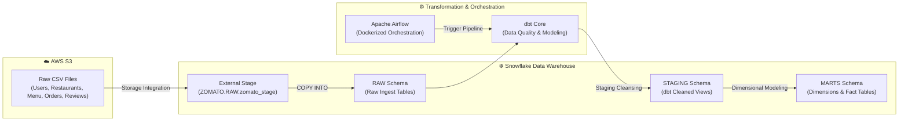

# 🍕 Zomato Food Delivery Data Pipeline

An end-to-end cloud data engineering pipeline for food delivery analytics, built with **Snowflake**, **dbt (data build tool)**, **AWS S3**, and **Apache Airflow**.

---

## 📌 Project Overview

The **Zomato Food Delivery Data Pipeline** transforms raw, unstructured, and semi-structured transactional dataset files (users, restaurants, menus, orders, line-item order details, and customer reviews) stored in Amazon S3 into clean, analytical star-schema data marts inside Snowflake. 

The pipeline ensures high data quality, automated staging transformations, financial aggregations, and containerized pipeline orchestration.

---

## 💡 Tech Stack Rationale: Why Snowflake + dbt + Airflow?

| Technology | Why It Was Chosen |
| :--- | :--- |
| **❄️ Snowflake** | • **Separation of Compute & Storage**: Cost-effective scaling of auto-suspending virtual warehouses (`ZOMATO_WH`).<br>• **Native S3 Integration**: High-throughput file ingestion using IAM Storage Integrations (`Zomato_s3_int`) and `COPY INTO` commands.<br>• **Role-Based Access Control (RBAC)**: Secure multi-schema isolation (`RAW`, `STAGING`, `MARTS`, `SNAPSHOTS`, `AI`). |
| **🥇 dbt (data build tool)** | • **Transformation Pushdown**: Executes SQL transformations directly inside Snowflake without extracting data.<br>• **Star-Schema Modeling**: Converts raw transactional data into clean dimensions (`dim_customer`, `dim_restaurants`, `dim_food`) and facts (`fct_orders`, `fct_order_items`).<br>• **Automated Data Testing**: Enforces schema constraints (`unique`, `not_null`) across core entities. |
| **⚙️ Apache Airflow** | • **Programmatic Orchestration**: Manages ingestion, dbt execution, and validation tasks via Python DAGs.<br>• **Containerized Environment**: Easy deployment and execution using Docker & Docker Compose (`docker-compose.yaml`). |

---

## 📐 Architecture Diagram



---

## 🧪 Data Quality & Custom Testing Framework

Data integrity is validated using dbt generic assertion tests configured in `__stage.yml` and `__sources.yml`:

- **Primary Key Uniqueness (`unique`)**: Asserts that every food record (`FOOD_ID`) has a distinct primary key.
- **Null Value Enforcement (`not_null`)**: Ensures critical columns (`FOOD_ID`, `FOOD_NAME`) cannot contain missing/NULL values.
- **Source Declarations (`__sources.yml`)**: Formalized definitions for raw tables in `ZOMATO.RAW` (`restaurants`, `users`, `food`, `menu`, `orders`, `order_items`, `reviews`).

To execute all tests across the pipeline:
```bash
cd zomato
dbt test
```

---

## 📁 Repository Structure

```text
zomato-pipeline/
├── airflow/
│   ├── dags/                  # Airflow DAGs for pipeline orchestration
│   ├── docker-compose.yaml    # Docker Compose setup for local Airflow cluster
│   └── Dockerfile             # Custom Airflow image with dbt/Snowflake dependencies
├── csv files/                 # Raw seed CSV datasets
├── snowflake_scripts/
│   ├── Zomato_01_setup.sql        # Database, Warehouse, Roles & Permissions setup
│   ├── Zomato_02_Staging.sql      # S3 Storage Integration & External Stage setup
│   ├── Zomato_03_TABLE_CREATE.sql # RAW schema DDL script with Foreign Key constraints
│   └── Zomato_04_Table load.sql   # COPY INTO commands & loading validation logs
└── zomato/                    # dbt Project Root
    ├── dbt_project.yml        # dbt project configuration
    ├── models/
    │   ├── staging/           # Cleaned staging views (stg_users, stg_orders, etc.)
    │   │   ├── __sources.yml  # Source table definitions
    │   │   └── __stage.yml    # Generic test assertions (unique, not_null)
    │   └── marts/             # Star-schema dimensions & facts
    ├── macros/                # Custom dbt SQL macros
    └── tests/                 # Data quality tests
```

---

## 🛠️ Infrastructure & Schema Setup

### 1. Snowflake Environment
- **Warehouse**: `ZOMATO_WH` (Size: `XSMALL`, Auto-Suspend: 60s, Auto-Resume: `TRUE`)
- **Database**: `ZOMATO`
- **Schemas**: `RAW`, `STAGING`, `MARTS`, `SNAPSHOTS`, `AI`
- **Role**: `DBT_ROLE`

### 2. Dimensional Data Model
- **`dim_customer`**: Customer profiles, age, gender, marital status, income brackets.
- **`dim_restaurants`**: Restaurant details, ratings, cuisines, address parsing.
- **`dim_food`**: Food item catalog (Veg vs. Non-Veg).
- **`fct_orders`**: Financial breakdown (subtotal, discounts, delivery fee, GST, sales amount), payment methods, and delivery duration.
- **`fct_order_items`**: Line-item quantities and price breakdowns.
- **`mart_city_wise_rder`**: Aggregated city-level order metrics and revenue totals.

---

## 🏃 Setup & Execution Instructions

### Step 1: Initialize Snowflake Database & Ingest Data
Execute the SQL scripts in Snowflake using `ACCOUNTADMIN` / `DBT_ROLE`:
```sql
-- 1. Create Warehouse, Database, Schemas, and Role
!sqlfile snowflake_scripts/Zomato_01_setup.sql;

-- 2. Configure AWS S3 Integration & Stage
!sqlfile snowflake_scripts/Zomato_02_Staging.sql;

-- 3. Create RAW Tables with Primary & Foreign Keys
!sqlfile snowflake_scripts/Zomato_03_TABLE_CREATE.sql;

-- 4. Ingest Raw CSV Data from S3 Stage
!sqlfile snowflake_scripts/Zomato_04_Table load.sql;
```

### Step 2: Run dbt Data Modeling & Tests
Navigate to the `zomato` directory and execute dbt:
```bash
cd zomato

# Test Snowflake connectivity
dbt debug

# Run staging and dimensional models
dbt run

# Run generic data quality tests
dbt test
```

### Step 3: Run Containerized Airflow Pipeline (Optional)
```bash
cd airflow
docker-compose up -d
```
Access the Airflow UI at `http://localhost:8080`.
